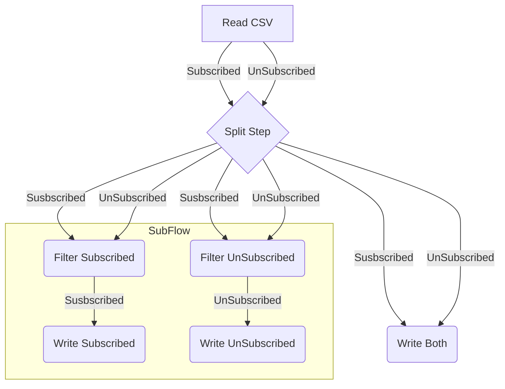

# Describe a chain using Yaml!

## How to read your Yaml File

The first step would be to initialize the `Builder` object. This will create a ChainProcessor from an array. 

First let's initialize a ChainBuilder with all the operation factories registered.
```php
$builder = new ChainBuilder(new ExecutionContextFactory());
$builder->registerFactory(new CsvExtractFactory('csv-read', CsvExtractOperation::class));
// ...
```

Then you can load the yaml and use it to create the ChainProcessor. 

```php
$chainProcessor $builder->buildChainProcessor(
    Yaml::parse(file_get_contents($fileName))['chain']
    [],
    10 // Max number of conncurent/asynchonous items to handle.
);
```

You can find a complete example in the examples [.init.php](examples/.init.php)

We can now execute our chain, with an Iterator as in input: 

```php
$chainProcessor->process(
    new ArrayIterator([__DIR__ . "/customers.csv"]),
    []
);
```

## Getting Started with a simple example

In order to go further let's use an example;

One of the simplest thing we can do with the etl is to read a csv file, modify each line and output a new csv file. 

Let us consider a csv file with 4 columns:
- ID
- FirstName
- LastName
- IsSubscribed

We would like to output a new CSV file with only 2 columns
- Name, that contains the concatenation of FirstName & LastName
- SubscriptionStatus which is the same value as the previous IsSubscribed column remapped. 

So our first operation needs to read a csv file. You can find an example csv file [here](examples/customers.csv)

```yaml
read-file:
    operation: csv-read
    options: []
```

The PhpEtl works with individual lines, so each individual line will be sent to the next step. This allows the ETL to 
be memory efficient to handle big volumes, but can be a constraint in some cases. 

In our Case let us add a rule operation to transform the files. We will check more about how to use later on for now 
let us look into a few details on how rule engine works: 

```yaml
keep-only-name-and-subscription:
  operation: rule-engine-transformer
  options:
    add: false # We want to replace all existing columns with our new columns.
    columns:
      Name:
        rules:
          - implode: # Concat both firstname & lastname
              values:
                - [{get : {field: 'FirstName'}}]
                - [{get : {field: "LastName"}}]
              with: " "
      SubscriptionStatus: # Fetch Is subscribe information without applying any transformation.
        rules:
          - get: {field: 'IsSubscribed'}
```

First we wish to say that we want to return a new data, and not add/merge data with the existing data. 
We do this by saying `add: false`. Then we will list the key values we wish to create; in our case we want **Name** 
and **SubscriptionStatus**.  

Let's start with **SubscriptionStatus** as it's easier as it requires no transformation. We will use a 
[get](RuleEngine.md#value-fetcher-get) rule to read  the existing data. Each rules section can have multiple
**rules**, each rule is executed individually and the first  non-null value is kept. 
If each rules returns null then null is kept. 

In this case we read the IsSubscribed without any fallback values, we could have added a constant as a fallback. 

For our **Name** we wish to concat 2 fields, we will therefore use the [implode](RuleEngine.md#implode-implode) rule. 
We need to define what string to use during the concatenation of our 2 value with `with: " "` then list the rules that
needs to be executed to fetch each value in the values field. This is like with the SubscriptionStatus field. But we 
will define 2 set of rules, one for the FirstName and a second for the LastName. 

Finally, let us write a new csv file. 

```yaml
write-new-file:
  operation: csv-write
  options:
    file: "output.csv"
```

This step is quite simple and the only option needed here is the name of the output file. 

The last thing to do is to start our chain process. Most processes will need to start with an input (there can be special cases). 
In our case this is the name of the csv file containing our customers.

```php
$chainProcessor->process(
    new ArrayIterator([__DIR__ . "/customers.csv"]),
    []
);
```

You can test this rule yourself, check the [transform yml](examples/00-describe/01-csv-transform.yml), and execute `php docs/examples/00-describe/01-csv-transform.php`

The way phpEtl works is by sending individual data to each step.
So our file path will be sent to the first step that will not return the file path, but will read the file and split 
that data in as many lines as the csv file contains. So running the Etl with multiple input file will allow us to use
this same chain to merge multiple customer csv files. 

```php
$chainProcessor->process(
    new ArrayIterator([__DIR__ . "/customers.csv", __DIR__ . "/customers2.csv"]),
    []
);
```

You can test this rule yourself by executing `php docs/examples/00-describe/02-csv-transform-merge.php`

## Fundamentals - Understanding the propagation

PhpEtl works by propagating Items from one end of the chain to the other. On it's way the Item can be: 
- **Replaced with an iterator:** In this case the individual item is replaced with a multitude of new items. For example when we receive a filename then read each individual line.  
- **Replaced**, when we create a new item based of the data of the pervious item. We used for example the **rule** operation with `add: false`
- **Modified:** when we modify the item. In the previous example if we replaced the **rule** operation with `add: true`
- **Untouched:** The operation might use the item todo a process but then return it back untouched. The write csv operation does this, it reads the item data and writes it in a file, then returns it back. Allowing additional processing to be done after.
- **Dropped:** A step might decide that the item is invalid, in which case we wish to prevent the item to continue to be propagated in the chain. We can also use this to group data.

## Fundamentals - Understanding more "complex" chains

Let us continue with a few additional examples to see how powerful phpEtl can be. We will get into more details on 
all available operations and options later.

### Example 03 - Grouping

A second example we can work on is to write a json file where customers are grouped based on their subscription state.
We will write this in json as its more suited to understand what we are doing. 

We will use the `simple-grouping` operation for this. **This operation needs to put all the data in memory
and should therefore be used with caution.**

```yaml
group-per-subscription:
  operation: simple-grouping
  options:
    grouping-key: ['IsSubscribed']
    group-identifier: []
```

We have a single **grouping-key**, we can make more complex grouping operations, by grouping by subscription status and
gender for example. 

Grouping identifier allows us to remove duplicates, if we had customer emails we could have used 
that information for example.

We will also use json write operation 

```yaml
write-new-file:
  operation: json-write
  options:
    file: "output.json"
```

This works like the csv file, but is more suited for complex multi level datas as we have after the grouping. 

You can test this rule yourself, check the [transform yml](examples/00-describe/03-json-grouped-merge.yml)
and by executing `php docs/examples/00-describe/03-json-grouped-merge.php`

### Example 04 - Keep subscribed customers only

We can also filter data preventing some of it from being propagated through all the chain, in our example
it will prevent unsubscribed customers from being written in our final csv file. 

```yaml
filter-unsubscribed:
  operation: filter
  options:
    rule: [{get : {field: 'IsSubscribed'}}]
    negate: false
```

The rule engine is used for the filtering, If the rule returns false, 0, empty string or null then the item **will not 
be propagated**. We can also inverse this rule, but changing `negate: true`, in this case the rule needs to return 
false for the item **to be propagated**.

This might seem limiting but the rule engine does support SymfonyExpressions which opens a whole lot of flexibility. 

You can test this rule yourself, check the [transform yml](examples/00-describe/04-csv-filter.yml)
and by executing `php docs/examples/00-describe/04-csv-filter.php`

### Example 05 - Write 3 customer files

In our next example which will be also the last of this section we wish to write 3 files. 
- One file containing all the customers
- A second file containing unsubscribed customers
- A third file with subscribed customers. 

To achieve this we will use the split operation. This operation creates multiple new chains linked to the first chain. 
The result of these new chains are not attached to the main chain. So if we do any filtering in one of these 
**branches** as they are called, the filtering will not be visible on the main branch. 

For our example, the main branch will be used to write all customers, this is very similar to what we did in the
first example. But before writing the files we will add a split operation to create 2 new branches. 1 branch will 
filter to get subscribed customers and write them. The second branch will filter to get un subscribed customers and 
write them. 

```yaml
  branch-out:
    operation: split
    options:
      branches:
        -
          filter-unsubscribed:
            operation: filter
            options:
              rule: [{get : {field: 'IsSubscribed'}}]
              negate: false

          write-new-file:
            operation: csv-write
            options:
              file: "subscribed.csv"
        -
          filter-subscribed:
            operation: filter
            options:
              rule: [{get : {field: 'IsSubscribed'}}]
              negate: true

          write-new-file:
            operation: csv-write
            options:
              file: "unsubscribed.csv"
```

You can test this rule yourself, check the [transform yml](examples/00-describe/05-csv-3-files.yml)
and by executing `php docs/examples/00-describe/05-csv-3-files.php`



### Example 06 - Making your chains configurable

You are able to configure through the input the names of the files that are being read. 

```php
$chainProcessor->process(
    new ArrayIterator([__DIR__ . "/customers.csv"]),
    []
);
```

But we might need to configure some operations independently from the input. For example the name of the csv output file. 

```yaml
write-new-file:
  operation: csv-write
  options:
    file: "output.csv"
```

The name "output.csv" is hardcoded here. But we can make this dynamic with symfony expression language. We will need
to start our line with the `!` character. 

```yaml
write-new-file:
  operation: csv-write
  options:
    file: "!filewriter['outputfile']['name']"
```

We will also need to give this informaton when the chain is being created: 

```php
$inputOptions = ['filewriter' =>
    ['outputfile' =>
        ['name' => 'configured-output.csv']
    ]
];

$chainProcessor = $builder->buildChainProcessor(
    Yaml::parse(file_get_contents($fileName))['chain'],
    $inputOptions
);
```

You can test this rule yourself, check the [transform yml](examples/00-describe/06-csv-transform.yml)
and by executing `php docs/examples/00-describe/06-csv-transform.php`

### Example 07 - Flatten yml files to csv

Complex `json` files can be flattened and have multiple columns using the rule engine. In our example [json](./examples/products.json) 
we have a list of products with their name, their skus etc. The name of the product is different for each locale. 

We could manually create a list of columns for each locale using the rule engine, but this will not be very generic, 
and if we have a lot of locales & a lot of translatable fields on our products this will be complicated to maintain.

We can use dynamic columns for this purpose. To use this we will need to list locales when starting the process: 

```php
$chainProcessor->process(
    new ArrayIterator([__DIR__ . "/products.json"]),
    [
        'locales' => ['fr_FR', 'en_US']
    ]
);
```

Then we will use the following rule to read the name for each of the given locales: 
```yaml
        'name-{@context/locales}':
          rules:
            - get : {field: ['name', '@context/locales']}
```

As you can see the `{@context/locales}` part of the columns name is dynamic. We can use then the get rule to read the 
data from that product. We could also have used symfony expression language but both behaves differently if the 
given locale is missing. `get` will simply return an empty column, symfony expression language rule will fail. 

You can test this rule yourself, check the [transform yml](examples/00-describe/07-json-transform.yml)
and by executing `php docs/examples/00-describe/07-json-transform.php`

### Example 08 - Write the result of an API to a CSV File. 

The php etl also provides a basic http client operation, this operation will allow us to get or push data throught
rest api's. 

Let's call a mock api returning a list of users.

```yaml
  get-from-api:
    operation: http
    options:
      url: https://63b687951907f863aaf90ab1.mockapi.io/test
      method: GET
      response_is_json: true
      option_key: ~
      response_key: ~
      options:
        headers: {'Accept': 'application/json'}
```

Using `response_is_json` allow us to decode the json returned by the api automaticall. `option_key` will allow us to 
pass additional options to the query. This can be used to add dynamic headers, or data that needs to be posted. 
If `response_key` is set that the response data will be added to the original data object. If not the response will 
replace the input data.

This will return a single DataItem with all the users of the api. We will need to split this item in order to process
each users individually. 

```yaml
  split-item:
    operation: split-item
    options:
      keys: ['content']
      singleElement: true
```

Now we can write the users into the csv file, as we have done so in our previous examples.
You can test this rule yourself, check the [transform yml](examples/00-describe/08-api-to-csv.yml)
and by executing `php docs/examples/00-describe/08-api-to-csv.yml`

### Example 09 - Write the result of an API to a CSV File.

Previously we fetched from a mock api all the users, what if we need to call individual api's for each user id. 
In order to achieve this we need the url of our api to be "dynamic" as at each execution we need to use another
user id. 

We can achieve this by using symfony expressions in the url key. To tell the operation that a symfony expression
is being used just prefix it with a `@`. (`!` is for using values from the input, @ is for using data from the current data.
All fields do not support `@` as it's handled by each operation. but all fields support `!` as it's generated before the etl starts 
processing).

```yaml
  get-from-api:
    operation: http
    options:
      url: '@"https://63b687951907f863aaf90ab1.mockapi.io/test/"~data["id"]'
      method: GET
      response_is_json: true
      option_key: "-placeholder-"
      response_key: ~
      options:
        headers: {'Accept': 'application/json'}
```
We will also change the `option_key`, if not our data (id = 1), will be sent into the options of the HttpClient, which 
will cause an error. Having an invalid key here will allow us not to have any options. 

Let us note that this operation runs multiple queries with concurrency. A single Symfony HttpClient is created for this
operation. And using the AsyncItems functionality of the ETL, we can run all the http requests in parallel. 

Now we can write the users into the csv file, as we have done so in our previous examples.
You can test this rule yourself, check the [transform yml](examples/00-describe/09-api-to-csv2.yml)
and by executing `php docs/examples/00-describe/09-api-to-csv2.yml`


## Additional information

### File Abstraction Layer

The etl has a file abstraction layer when reading & writing files. By default, that's the local file system and
gives the etl access to all files on the server. 

Different integrations of the ETL will behave differently. The symfony integration for example will create a directory 
per execution and each execution will only be able to interact with files in that directory by default. This allows 
user interfaces to display loaded & extracted files.

### Conclusion

You can now read the [Operations](Operations.md) documentation that list all available operations.

You can also read all [Available Rules](RuleEngine.md) for the rule operation as well additional examples for the rule
engine [Rule Engine Examples](RuleEngineExamples1.md). 

If you want to create more complex chains, you might also wish to read the [second chapter](DescribeChain-01.md) 
which will explain the usages of the subchains. 